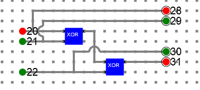
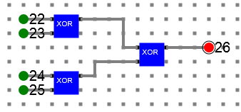
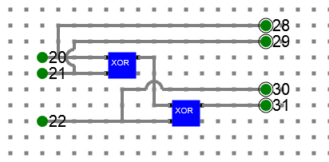
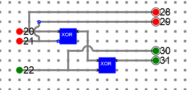
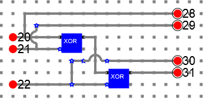
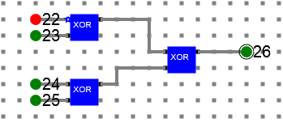
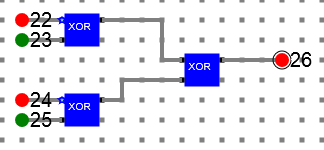
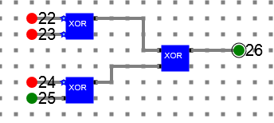

# Procedure

- Design the below **Parity generator** and **Parity checker** circuits
- Verify the **Parity generator** and **Parity checker** tables explained in theory

## Parity generator

***Y = A ⊕ B ⊕ C***

### Circuit diagram

## 4-bit Parity checker: 

(A ⊕ B) ⊕ (C ⊕ P)

### Circuit diagram

- Below is the even parity generator circuit diagram for a 3 bit data. Data bits are represented by label **20, 21, 22** and the parity bit is represented with label **31**. Final data including parity will be **28, 29, 30, 31**. Even parity will make sure there are even number of 1’s at the output including parity. 

- Below is the even parity checker circuit diagram for a 4 bit message. The bit represented by label **26** shows if there is any error (it shows green for no-error) or not (it shows red for no-error). It is clearly visible, if there is even number of 1’s in the data, then parity checked is low means no error. Otherwise it is high means there is some error in the data.

## Refer the simulator manual on how to design the circuit
- Manual --> [Click Here](./simulation/coavlNew.pdf)

<embed src="./simulation/coavlNew.pdf" type="application/pdf">

