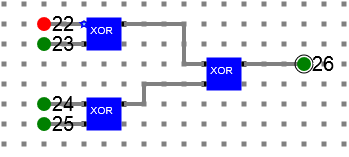
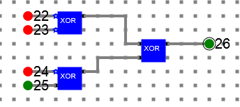

# Theory:

In digital systems, when binary data is transmitted and processed, data may be subjected to noise so that such noise can alter 0s (of data bits) to 1s and 1s to 0s. 

Hence, a Parity Bit is added to the word containing data in order to make number of 1s either even or odd. The message containing the data bits along with parity bit is transmitted from transmitter to the receiver.

At the receiving end, the number of 1s in the message is counted and if it doesn’t match with the transmitted one, it means there is an error in the data. Thus, the Parity Bit it is used to detect errors, during the transmission of binary data.

A Parity Generator is a combinational logic circuit that generates the parity bit in the transmitter. On the other hand, a circuit that checks the parity 
in the receiver is called Parity Checker. 

The sum of the data bits and parity bits can be even or odd. In even parity, the added parity bit will make the total number of 1s an even number, whereas in odd parity, the added parity bit will make the total number of 1s an odd number.

Here is the truth table for even parity generator for a 3 bit message:

<table>
<tr>
<td colspan="3">
<b>3-bit  message</b>
</td>
<td>
<b>Even parity bit generator (P)</b>
</td>
</tr>
<tr><td>
<b>A</b>
</td><td>
<b>B</b>
</td><td>
<b>C</b>
</td><td>
<b>Y</b>
</
</tr>
<tr><td>
0
</td><td>
0
</td><td>
0
</td><td>
0
</td></tr>
<tr><td>
0
</td><td>
0
</td><td>
1
</td><td>
1
</td></tr>
<tr><td>
0
</td><td>
1
</td><td>
0
</td><td>
1
</td></tr>
<tr><td>
0
</td><td>
1
</td><td>
1
</td><td>
0
</td></tr>
<tr><td>
1
</td><td>
0
</td><td>
0
</td><td>
1
</td></tr>
<tr><td>
1
</td><td>
0
</td><td>
1
</td><td>
0
</td></tr>
<tr><td>
1
</td><td>
1
</td><td>
0
</td><td>
0
</td></tr>
<tr><td>
1
</td><td>
1
</td><td>
1
</td><td>
1
</td></tr>
</table>

## Parity generator

Y = A ⊕ B ⊕ C

Below is the even parity generator circuit diagram for a 3 bit data. Data bits are represented by **label 20, 21, 22** and the parity bit is represented with **label 31**.

Here is the parity checker truth table for a 4 bit message including parity bit.

<table>
<tr>
<td colspan="4">
<b>4-bit received message</b>
</td>
<td>
<b>Parity error check</b>
</td>
</tr>
<tr><td>
<b>A</b>
</td><td>
<b>B</b>
</td><td>
<b>C</b>
</td><td>
<b>P</b>
</td><td>
<b>Cp</b>
</td>
</tr>
<tr><td>
0
</td><td>
0
</td><td>
0
</td><td>
0
</td><td>
0
</td></tr>
<tr><td>
0
</td><td>
0
</td><td>
0
</td><td>
1
</td><td>
1
</td></tr>
<tr><td>
0
</td><td>
0
</td><td>
1
</td><td>
0
</td><td>
1
</td></tr>
<tr><td>
0
</td><td>
0
</td><td>
1
</td><td>
1
</td><td>
0
</td></tr>
<tr><td>
0
</td><td>
1
</td><td>
0
</td><td>
0
</td><td>
1
</td></tr>
<tr><td>
0
</td><td>
1
</td><td>
0
</td><td>
1
</td><td>
0
</td></tr>
<tr><td>
0
</td><td>
1
</td><td>
1
</td><td>
0
</td><td>
0
</td></tr>
<tr><td>
0
</td><td>
1
</td><td>
1
</td><td>
1
</td><td>
1
</td></tr>
<tr><td>
1
</td><td>
0
</td><td>
0
</td><td>
0
</td><td>
1
</td></tr>
<tr><td>
1
</td><td>
0
</td><td>
0
</td><td>
1
</td><td>
0
</td></tr>
<tr><td>
1
</td><td>
0
</td><td>
1
</td><td>
0
</td><td>
0
</td></tr>
<tr><td>
1
</td><td>
0
</td><td>
1
</td><td>
1
</td><td>
1
</td></tr>
<tr><td>
1
</td><td>
1
</td><td>
0
</td><td>
0
</td><td>
0
</td></tr>
<tr><td>
1
</td><td>
1
</td><td>
0
</td><td>
1
</td><td>
1
</td></tr>
<tr><td>
1
</td><td>
1
</td><td>
1
</td><td>
0
</td><td>
1
</td></tr>
<tr><td>
1
</td><td>
1
</td><td>
1
</td><td>
1
</td><td>
0
</td></tr>

</table>

## Corresponding parity checker: 

(A ⊕ B) ⊕ (C ⊕ P)

Below is the even parity checker circuit diagram for a 4 bit message. The bit represented by **label 26** if red then there is no error and if green then there is some error in the data.

