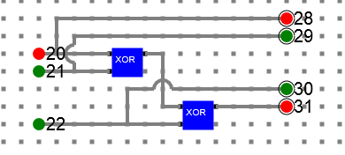
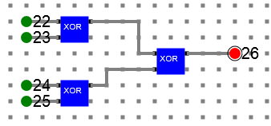

# Procedure

- Design the below **Partity generator** and **Parity checker** circuits
- Verify the **Partity generator** and **Parity checker** tables explained in theory

## Parity generator

***Y = A ⊕ B ⊕ C***

### Circuit diagram

## 4-bit Parity checker: 

(A ⊕ B) ⊕ (C ⊕ P)

### Circuit diagram

- Refer the simulator manual on how to design the circuit
    - Manual --> [Click Here](./simulation/coavlNew.pdf)

<embed src="./simulation/coavlNew.pdf" type="application/pdf">

